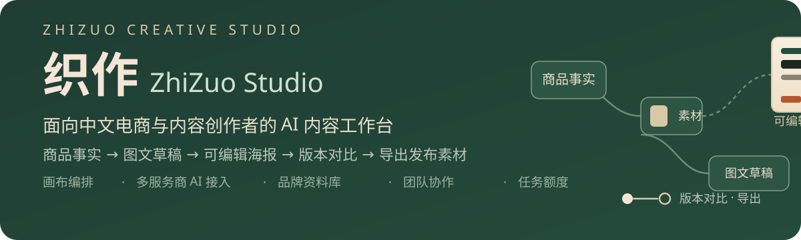
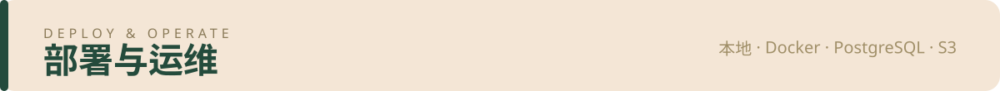

<p align="center">
  
</p>

<p align="center">
  
  
  
  
  
</p>

**织作 ZhiZuo Studio** 把商品事实、素材、图文草稿和海报版本放在一张画布中：确认商品事实 → 生成或手写图文 → 排出可编辑海报 → 版本对比 → 导出发布素材，全程可回溯。

- **品牌资料库**：颜色、语气、禁用词、字体与 Logo 一键应用到项目（[BRANDS.md](docs/BRANDS.md)）
- **只读分享**：选定版本的限时快照链接（[SHARING.md](docs/SHARING.md)）
- **团队协作**：邀请成员共享工作空间、多空间切换、移除即失效
- **账号安全**：自助改密、账号级数据导出、删除与审计保留
- **任务额度与独立 worker**：数据库租约、处理记录时间线、死信人工核对、用量告警与提交限流

| 目录 | 内容 |
| --- | --- |
| [快速开始](#快速开始) | 本地启动、运行验证、Docker 部署、接入真实模型 |
| [能力与配置](#能力与配置) | 账号模式、对象存储、独立 worker 与额度 |
| [部署与边界](#部署与边界) | 数据边界、回滚与诚实声明 |
| [文档索引](#文档索引) | 设计、验证与工程全量记录 |

当前处于开发阶段；自动化门禁与真实环境验收的边界以 [docs/TASKS.md](docs/TASKS.md) 为准，不把模拟测试说成真实供应商验证。

<a id="快速开始"></a>


### 本地启动

需要 Node.js 22.13+（推荐 24）。无需 Docker：默认使用磁盘持久化的 PGlite（PostgreSQL 引擎）。

```sh
npm ci
cp .env.example .env
npm run dev
```

打开 http://127.0.0.1:5173 。API 位于 http://127.0.0.1:4317 。本地模式只监听 loopback，数据和自动生成的加密密钥位于 `.data/`，不要提交或分享该目录。

配置真实模型：工作台「模型接入」添加服务商、HTTPS Base URL、API Key、文本模型和图片模型。支持 OpenAI 兼容、Gemini 原生、受限 JSON 异步协议。密钥由服务器 AES-GCM 加密存储；浏览器只读取 hasKey，不会再次得到密钥。真实生成由你配置的服务商计费。

未配置模型时，可以上传真实图片、编辑内容简报、制作模板海报、保存版本、导出 PNG 和备份项目。没有假 AI 结果。

### 运行与验证

```sh
npm run typecheck
npm test
npm run build
npm start
```

构建后 API 同时提供网页：http://127.0.0.1:4317 。运行目录必须是项目根目录，以便加载字体和静态产物。

### Docker 部署

仓库根目录提供 `compose.yaml` 与 `Dockerfile`，单容器包含 Web、API 与内嵌 worker：

```sh
cp .env.example .env   # 或自行创建，见下
docker compose up -d --build
```

`.env` 至少需要：`AUTH_MODE=shared`、≥16 字符的 `APP_PASSWORD`、64 位十六进制的 `ENCRYPTION_KEY`、`APP_ORIGIN`（对外访问地址）。账号模式改为 `AUTH_MODE=accounts` 并填 `ADMIN_EMAIL` / `ADMIN_PASSWORD`。数据保存在 Docker 卷 `zhizuo-studio_studio-data` 中；升级镜像不会删除该卷，删除卷即清空所有项目数据。服务发布在 `http://127.0.0.1:4317`，生产环境请置于 HTTPS 反向代理之后。

<a id="部署与边界"></a>


### 数据与部署边界

- `DATABASE_URL` 可连接 PostgreSQL；未设置时使用 `.data/db`。
- 素材可使用 `.data/assets` 或 S3 兼容私有存储；本地 PGlite 使用内嵌 worker，PostgreSQL 可将 worker 独立部署。备份需要数据库、素材及加密密钥；界面项目 ZIP 不含密钥。
- 私有部署可用 `AUTH_MODE=shared`（至少 16 字符 `APP_PASSWORD`），或 `AUTH_MODE=accounts`（首次设置 `ADMIN_EMAIL`、`ADMIN_PASSWORD`）。设置 `APP_ORIGIN` 并使用 HTTPS 反向代理。账号模式为每个账号提供隔离的个人空间，管理员可管理账号但不能查看其他账号作品；尚无团队共享和公开注册。
- 任务记录持久化，每个 worker 最多两个任务并行，领取/续租/发布由数据库租约协调。服务中断时已开始的任务进入「需要核对」。已保存上游任务编号的异步 JSON 任务可在有限次数与时间内继续 GET 查询；其他协议不会自动重复提交可能收费的请求。
- 目前不承诺供应商请求的 exactly-once：网络超时可能发生在供应商已接收之后。请核对供应商任务/账单，再决定是否重试。
- 模型连接探测不调用收费生成接口；异步自定义协议只能通过真实任务验证。供应商兼容性以测试与实际接入记录为准。

<a id="文档索引"></a>


### 来源与许可

[docs/REFERENCE_REVIEW.md](docs/REFERENCE_REVIEW.md) 记录开源研究和固定版本。当前业务代码独立实现；画布使用 MIT 的 React Flow，前端实际采用 shadcn/ui 与 Radix（组件许可见 `apps/web/src/components/ui/LICENSE.shadcn.md`），字体使用 SIL OFL 的 Noto Sans SC（许可见 `apps/server/fonts/OFL.txt`）。没有复制 CC BY-NC-SA 项目的商业受限代码。项目本身的发布许可证待所有者决定。

### 界面设计与检查

界面参考与访问边界见 [UI_REFERENCES.md](docs/UI_REFERENCES.md)，基于用户指定设计技能的改动与静态审阅见 [UI_POLISH_REVIEW.md](docs/UI_POLISH_REVIEW.md)。布局采用暖白与深绿的中文内容工作台，正文14–16px，窄屏重排和主要触控控件44px。视觉、键盘和真实浏览器验收状态以验证记录为准。

### 全量文档

| 文档 | 内容 |
| --- | --- |
| [TASKS.md](docs/TASKS.md) | 阶段任务、验收记录与诚实缺口 |
| [ARCHITECTURE.md](docs/ARCHITECTURE.md) | 运行形态、数据模型、任务与额度架构 |
| [BRANDS.md](docs/BRANDS.md) / [SHARING.md](docs/SHARING.md) | 品牌资料库与只读分享合同 |
| [ACCOUNTS.md](docs/ACCOUNTS.md) | 账号、团队成员与生命周期保留策略 |
| [STORAGE.md](docs/STORAGE.md) | 本地 / S3 存储、上传租约与预签名 |
| [WORKERS.md](docs/WORKERS.md) / [QUOTAS.md](docs/QUOTAS.md) | 独立 worker 租约与任务额度账本 |
| [PROVIDERS.md](docs/PROVIDERS.md) | OpenAI 兼容 / Gemini / 异步 JSON 接入合同 |
| [MIGRATIONS.md](docs/MIGRATIONS.md) | 认证模式与存储迁移边界 |
| [PLATFORM-RULES.md](docs/PLATFORM-RULES.md) | 排版预设版本与平台规范核查 |
| [PERF-BASELINE.md](docs/PERF-BASELINE.md) | 画布性能基线与复测方法 |
| [UI_REFERENCES.md](docs/UI_REFERENCES.md) / [UI_POLISH_REVIEW.md](docs/UI_POLISH_REVIEW.md) | 界面参考与静态审阅 |
| [REFERENCE_REVIEW.md](docs/REFERENCE_REVIEW.md) | 开源研究与许可核查 |

<a id="能力与配置"></a>


### 账号与团队

保持默认配置即可本地使用。启用账号模式时，在你自己的 `.env` 中配置 `AUTH_MODE=accounts`、`ADMIN_EMAIL`、至少12字符的 `ADMIN_PASSWORD` 和 `APP_ORIGIN`。首次启动会创建管理员和个人空间，随后重启不会重置密码；确认能登录后可移除首次管理员密码环境变量。

管理员通过「账号管理」创建成员。每位成员的项目、图片、版本、模型密钥、任务和用量分别隔离；停用账号会撤销会话并停止本地未完成任务。已发送的远端任务不保证被取消或退款。账号与本地模式互切时不会自动转移资料，见 [迁移说明](docs/MIGRATIONS.md)。

账号与团队相关操作：成员可在「团队协作」页自助修改密码、导出全部数据、删除账号；所有者可生成邀请链接（72 小时内有效、可撤销）让已有账号加入工作空间，并随时移除成员（其访问立即失效）。管理员可为成员重置密码、导出数据或永久删除账号。删除前请先导出；额度审计记录按合规要求保留，其余数据不可恢复。

### 对象存储与预签名

安装依赖已包含 AWS 官方 S3 客户端。将 `STORAGE_BACKEND=s3`，并填写 `.env.example` 中 S3 Endpoint、区域、私有桶和服务端凭据；默认 path-style，可按服务商设置关闭。上传和下载默认仍经受认证保护的 API；S3 后端额外支持**预签名直传与直链下载**（`uploads/presign` 与 `download-url`，带上传租约与有效期，详见 [STORAGE.md](docs/STORAGE.md)）。

媒体处理有40 MiB单对象上限；新上传先记录 `pending_assets`，启动和每分钟尝试恢复清理。更改桶、前缀或端点不会误清另一位置的残留；也不会自动迁移旧文件。详见 [STORAGE.md](docs/STORAGE.md)。请先导出项目备份，再在独立数据目录验证新后端并导入。

### 独立 worker 与任务额度

默认 `WORKER_MODE=inline`，适合本地开发。拆分时给 API 设置 `WORKER_MODE=external`、`DATABASE_URL` 和固定 `ENCRYPTION_KEY`；API 与 worker 必须使用相同认证模式、加密密钥和素材存储。先启动 API 完成迁移/首次账号初始化，再启动 worker：

```sh
npm run build
npm start
# 另一个终端，使用相同配置：
npm run start:worker
```

开发调试可用 `npm run dev:worker`。PGlite 数据目录不可由多个进程同时打开，独立 worker 启动会明确要求 PostgreSQL。此阶段验证一个 API 与多个 worker；没有将其称为任意数量 API 实例的完整横向扩展验收。旧版无租约 worker 必须先停止，禁止与新版本混跑。

「用量与额度」显示按工作空间统计的每日任务额度、预占、消耗和待核对记录，日期使用 Asia/Shanghai。新任务与预占记录在同一事务提交，失败一起回滚。结果未知时保留额度；管理员或本地工作台操作者可写明依据并核对。额度用量越过 80% / 100% 时会写入一次性告警事件；每个用户的任务提交另有滑动窗口限流（`USER_TASK_RATE_PER_MINUTE`，默认每分钟 20 次，超限返回 429）。额度是任务次数，实际供应商费用仍以其账单为准；此功能没有接入收付款。生成任务会记录处理事件（入队、领取、提交检查点、发布、核对、死信等），可在任务面板展开「处理记录」查看时间线；自动查询停止的任务会标示"需人工核对"。

详见 [WORKERS.md](docs/WORKERS.md)、[QUOTAS.md](docs/QUOTAS.md)。连接真实 PostgreSQL 的独立验证命令为 `npm run test:postgres`，要求 `POSTGRES_TEST_URL` 指向 **127.0.0.1** 上名为 `zhizuo_validation` 的专用空闲测试实例，测试会创建/删除自己随机命名的数据库，不接受生产或远端数据库地址。
