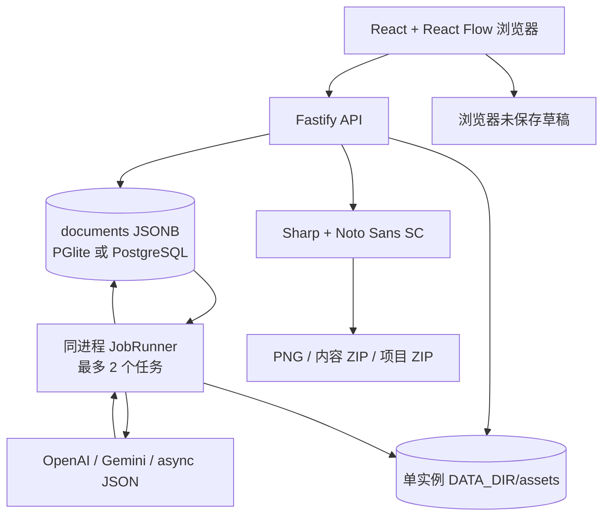
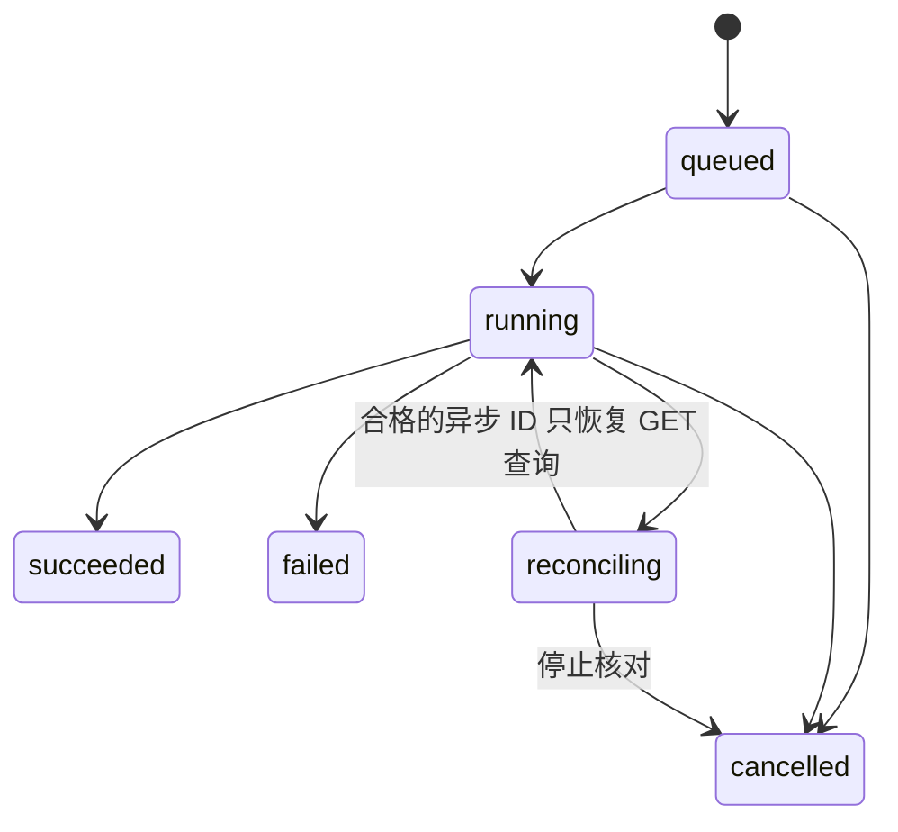

# 织作当前架构与演进边界

基于 2026-09-30 当前源码整理。这里描述已存在的实现结构，功能是否通过测试另见 `TASKS.md` 的验收记录。

## 当前运行形态

织作是一个 Web 客户端加单个 Node.js 服务的应用，面向本地使用或一个私有工作空间。API 与持久任务执行器运行在同一进程；业务文档保存在 PGlite 或 PostgreSQL；图片保存在该实例磁盘。构建后同一个服务可提供前端静态文件。

开发前端为 `http://127.0.0.1:5173`，API 默认 `http://127.0.0.1:4317`；Vite 将 `/api` 代理到 4317。旧端口 4310 被本机其他应用占用，已同步调整服务默认值、示例环境与开发代理。构建后 `npm start` 在 4317 同时提供页面和 API；自行修改 PORT 时也要同步本地代理配置。

此结构没有独立队列服务、S3、共享文件系统、分布式任务租约或多账号权限。设置 `DATABASE_URL` 只切换数据库，不会自动让图片和任务执行器支持多实例。

## 工程目录

| 路径 | 当前职责 |
| --- | --- |
| `apps/web/src` | 项目工作台、画布、简报、文案 / 海报编辑、任务面板、渠道配置 |
| `apps/web/src/components/ui` | 官方 shadcn/ui registry 的 Button、Card、Input、Textarea、Dialog、AlertDialog、Tabs、Badge、Label、Field、Table；Field 使用 Separator |
| `apps/web/src/shadcn-theme.css` | shadcn 语义主题变量；`styles.css` 承担现有品牌和响应式布局 |
| `apps/server/src/app.ts` | API、共享密码会话、输入检查、资源端点、生成提交、导出 |
| `apps/server/src/db.ts` | PGlite / PostgreSQL 共用访问层和初始化表 |
| `apps/server/src/repository.ts` | 项目 revision 更新、版本写入、画布节点回填 |
| `apps/server/src/jobs.ts` | 持久任务读取、原子认领、执行 / 取消 / 中断核对、用量记录 |
| `apps/server/src/providers.ts` | 三种协议、加密凭据、HTTPS / DNS 校验、请求与响应适配 |
| `apps/server/src/media.ts` | 图片归一化、缩略图、字体渲染、PNG 导出 |
| `apps/server/src/backup.ts` | 项目 ZIP 打包、校验、恢复为新项目、引用重映射 |
| `packages/shared/src` | 前后端共享实体、模板与中文换行 / 内容提示规则 |
| `apps/server/tests` | 服务端与供应商合同测试；通过状态以运行记录为准 |

画布采用 MIT 的 React Flow；业务代码独立实现。infinite-canvas 用作交互和多渠道研究来源，没有 fork 其完整应用，也没有继承其存储格式。来源及许可证见 `REFERENCE_REVIEW.md`。

shadcn 组件使用 Radix primitive，源码与 MIT 许可保存在组件目录；`ui.tsx` 封装项目中的 Dialog / AlertDialog。设计参考和实际 UI 调整分别见 `UI_REFERENCES.md` 与 `UI_POLISH_REVIEW.md`。项目首页优先最近项目，移动端通过面板切换和卡片重排保持字号；这些源码改进已记录，浏览器权限策略仍阻止本地渲染验收。

Dashboard、Providers、ProjectEditor 按页面使用 React.lazy / Suspense 加载。最新构建主 JS 为 313.30kB（gzip 101.64kB），ProjectEditor 分块为 254.87kB（gzip 81.03kB），先前单 JS 超过 500kB 的警告消失。分包只证明构建结构变化；字体 / 样式资源体积、加载耗时、200 节点场景和运行时帧率仍需实际测量。

## 数据模型与保存

默认 `DATA_DIR=.data`。未配置 `DATABASE_URL` 时，PGlite 将 PostgreSQL 引擎数据写到 `DATA_DIR/db`；配置后使用 `postgres` 客户端访问 PostgreSQL。

当前数据库有：

- `documents(scope, id, body jsonb)`，以 `(scope,id)` 为主键，按 JSON 中 `projectId` 建索引。
- `migrations(version, applied_at)`，当前记录初始化版本 1；尚无后续版本迁移执行器。

scope 包含 projects、assets、versions、tasks、providers、sessions、usage。它们是统一文档表里的分类，不是具有独立外键约束的完整关系模型。

项目聚合包含 title、brief、board、revision 和时间。board 使用 `schemaVersion: 1`，包括节点、连线和 viewport；当前节点 kind 是 brief / asset / copy / poster / image，连线为 source / target 和可选 label。原计划的独立 prompt、generation、annotation、group 节点与类型化关系需要后续实现。

编辑端约 800ms 防抖保存；服务端要求客户端提交 revision，以带条件的 UPDATE 防止静默覆盖。冲突时返回 409，浏览器保留未保存草稿，提供合并或重新加载。当前合并以本地已编辑布局为主补入新节点 / 连线，不是多用户文本合并或 CRDT。

撤销 / 重做当前是浏览器会话里的画布快照栈，最多保留约 40 项；它不替代内容版本和实例备份。

## 内容版本与素材

ContentVersion 保存 copy、poster 或 image 之一，可关联 `parentVersionId`、`taskId` 和 `inputSnapshot`。手动编辑保存新版本，生成任务成功保存来源快照；回填节点使用父版本或简报作为来源。移除画布节点不删除底层版本。

项目素材有尺寸、大小、项目 ID、原图 / 缩略图 URL。上传接受静态 JPG / PNG / WebP / AVIF，检查输入大小和像素数，用 Sharp 归一化为 PNG，并创建不超过 640×640 的 WebP 缩略图。文件按服务端 UUID 命名，写入 `DATA_DIR/assets`。

任务、版本、画布回填以及磁盘写入目前不是一个跨数据库与文件系统的原子事务。成功版本 ID 使用任务 ID 辅助去重，但进程在不同步骤间退出仍需恢复检查；现有实现不能宣称 exactly-once 或零孤儿文件。

## 生成任务与计费语义

提交 API 将项目简报、渠道配置、加密密钥和请求内容快照写入 tasks。项目 ID 加 `idempotencyKey` 生成稳定任务 ID，数据库唯一键避免重复入队。相同键返回既有任务，调用者应为一次意图复用键、为新的生成意图生成新键。

JobRunner 每约 800ms 查看任务，使用条件 UPDATE 将 queued 原子改为 running，一次实例最多执行 2 个任务。它不使用 Redis、BullMQ 或独立 worker 进程。

`reconciling` 表示供应商可能已接受请求，需要核对。重启时，数据库中遗留的 running 会转为 reconciling；queued 可继续执行。已发送的付费请求遇到超时、网络故障或部分响应异常，不盲目重新提交。取消运行任务停止本地等待，但不保证取消供应商任务或退款。

`async-json` 图片提交拿到有效上游 ID 后，先将 `upstreamTaskId` 写入 tasks，再首次轮询。恢复保留原任务的渠道和加密密钥快照，仅 GET 查询原任务及下载结果，最多额外 3 个回合；失败后下一回合按 5 / 15 / 45 秒退避，收到 ID 起最多 15 分钟，次数、下次时间和截止时间持久化。每个回合最多查询 60 次，同时受渠道超时和剩余窗口限制。没有保存 ID、非异步图片、到达限额、已停止核对或本地清理失败时不能恢复。

单进程内认领、取消和发布共用每任务互斥，取消不会与半完成发布同时执行；成功任务使用稳定版本 ID，已提交成功后的响应丢失不会主动删除已完成版本。失败时尝试清理本次版本、节点和未被其他内容引用的生成素材。任务面板展示上游 ID 与“停止核对”，取消停止本地查询，不保证供应商远端任务停止。原计划中的任务事件、死信、分布式租约和供应商回调幂等仍需后续实现。

usage 保存任务种类、渠道、状态和时间，成本为 `null` / `not_reported`。`MAX_DAILY_TASKS` 默认为 100，对整个实例按 UTC 日期统计创建次数；它不是用户额度、货币成本、预占账本或支付系统。尚无实际费用对账与退款机制。

## 接入层与访问边界

渠道协议为 `openai`、`gemini`、`async-json`，详细合同见 `PROVIDERS.md`。多个渠道可拥有相同模型名，通过稳定 providerId 路由。Base URL 保留原路径前缀，不自动加 `/v1`。

配置密钥以 AES-256-GCM 加密存储，服务器从 `ENCRYPTION_KEY` 或 `DATA_DIR/encryption.key` 获得 32 字节密钥。自动创建的文件权限为 0600。项目备份不包含渠道与任务凭据；读接口不返回完整 API Key。数据库与加密密钥同时泄漏仍可解密，这是当前部署保护边界。

模型请求与结果下载要求公共 HTTPS；发送前检查 DNS 并固定连接地址，拒绝内网 / localhost / 保留地址，带凭据的重定向不能跨站。下载结果不转发 API Key。此实现不支持内网自托管模型，也不是任意 HTTP 转发代理。

本地入口默认监听 127.0.0.1。非 loopback 监听要求至少 16 字符的 `APP_PASSWORD` 与 `APP_ORIGIN`；私有部署应使用 HTTPS 反向代理。共享密码登录产生七天会话 Cookie，服务端保存 token 哈希。请求包含来源检查，失败登录有次数限制。

所有通过共享密码的用户共享整个空间，当前没有 users / workspace_members、账号隔离、角色、邀请或只读分享。不能将 projectId 归属校验称作租户隔离。现有登录限速只存进程内存，不是集中式风控。

## 中文排版与导出

模板为 1080×1440 小红书图文、1080×1080 商品主图、1080×1920 活动竖图。它们是编辑设计预设，不是已核实的官方发布规范。

海报保存文字图层和图片框，而不是把标题或价格固化进 AI 图片。前后端共用 `layoutPoster` 的中文换行规则；浏览器使用 SVG，服务端用 Sharp / Pango 和内置 Noto Sans SC 字体逐行合成 PNG。相同换行算法只能证明规则共享，最终像素、基线和字重仍需视觉验收。

导出 API 接受最多 20 个版本和明确 `acknowledged:true`，输出内容 ZIP：图片 / 海报 PNG、文案 Markdown / JSON、警示清单。当前导出和预览在 HTTP 请求内执行，不是独立持久导出任务；大项目与高并发需要后续异步化和容量验证。

基础内容检查是有限的词项和风险提醒，不代表平台审核、法律审查或商品真实性保证。输出仍由创作者审核后通过平台入口发布。

## 备份、恢复与实例运维

项目备份 ZIP 包含 `project.json`、项目素材和版本，支持当前 schemaVersion=1；恢复会建立新项目并重映射素材、版本、节点、连线和父版本引用。版本 `createdAt` 与 `inputSnapshot` 已纳入可选导入字段：旧备份缺少时间时才使用恢复时间；快照中名为 `assetId` / `referenceAssetId` / `copyVersionId` / `parentVersionId` 的已知引用递归映射到新 ID。未知字段保留，不将它们当作已验证的关系模型。

写入新项目之前，验证素材文件存在、素材 / 版本 / 节点 / 连线 ID 不重复，结构化节点、边、版本与父版本引用不悬空，且版本来源不循环。该检查不代表任意 `inputSnapshot` 内容均被验证。备份不包含渠道、API Key、会话、额度和可恢复执行的任务历史；导入版本不会还原供应商任务或凭据，项目 ZIP 不能替代实例备份。保留时间 / 快照的恢复实现已存在，对应完整往返验收需以测试记录为准。

备份资产合计限制 100 MB，导入解压大小限制 110 MB，project.json 限制 5 MB。失败恢复会尝试清理本次新建记录和素材，不会覆盖源项目。

整实例恢复应备份：PGlite 的完整数据目录或 PostgreSQL 数据库、`DATA_DIR/assets`、加密密钥以及必要部署配置。不要在进程正在写 PGlite 时简单复制目录后假定一致；停止写入或采用对应数据库支持的备份方式，并实际演练恢复。

当前尚无自动快照计划、文件生命周期、资产删除策略、加密密钥轮换、结构化审计日志或自动故障告警。扩展这些能力时，应保留旧 schema 可读取并建立迁移前快照。

## 向托管 MVP 的后续演进

| 顺序 | 工作 | 必须新增的证明 |
| --- | --- | --- |
| 1 | 个人账号、workspace 和权限模型 | 账户 A 无法读写 B 的项目、素材、任务、版本、渠道与导出 |
| 2 | 媒体存储适配及 S3 直传 | 私有对象权限、预签名有效期、实际字节校验、孤儿清理与恢复 |
| 3 | 独立 worker 与分布式任务恢复 | 在现有单实例异步 ID 持久化 / GET 续查基础上，验证任务租约、并发多 worker、回调 / 轮询幂等 |
| 4 | 额度账本和费用对账 | 预占、成功结算、失败释放、未知费用核对、重复事件不重复扣减 |
| 5 | 品牌库、分享、审计和可观测性 | 对应权限与真实使用闭环；指标不含秘密数据 |
| 6 | 支付、账号删除与公开运营能力 | 支付 / 退款合同、资源清理、限流、成本告警、部署恢复演练 |

需要先完成真实浏览器、数据库和供应商验收，再将功能从“存在实现”改为“已验证”。完整任务与原计划缺口见 `TASKS.md`。
